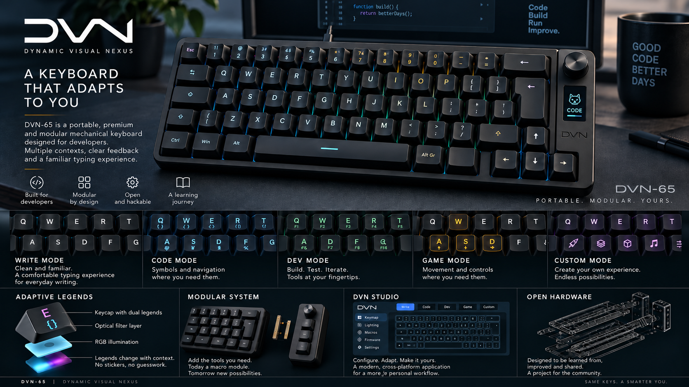

# DVN-65

<p align="center">
  
</p>

<p align="center"><sub>Conceptual visualization — the physical design is still evolving.</sub></p>

**DVN — Dynamic Visual Nexus**

A portable, premium, modular mechanical keyboard platform designed around software development.

> **Project status:** Phase 0 — Foundation. DVN-65 is an early engineering project; several core subsystems are still being researched and validated.

## What is DVN-65?

DVN-65 is the first keyboard in the **Dynamic Visual Nexus** project.

The goal is not simply to build another custom mechanical keyboard. DVN explores how a developer-focused keyboard can combine a familiar typing experience with measurable ergonomic improvements, context-aware controls, adaptive visual feedback, modular hardware, programmable firmware, and a dedicated configuration application.

The project is also a hands-on engineering learning platform spanning electronics, PCB design, firmware, mechanical design, optics, desktop software, ergonomics, prototyping, and manufacturing.

## Design principles

- **Developer-first** — programming usefulness should be measurable, not marketing.
- **Familiar first** — preserve ISO-ES and recognizable typing behavior.
- **Portable premium** — premium feel without excessive size, weight, or cost.
- **Context-aware** — physical modes and visual feedback adapt the keyboard to the task.
- **Modular** — side modules extend the platform without redesigning the core keyboard.
- **Standalone** — once configured, the keyboard should work without resident software.
- **Open and reproducible** — decisions, experiments, and engineering work should be documented.
- **Learn by building** — the engineering process matters as much as the final device.

## Core systems

| System | Purpose | Status |
| --- | --- | --- |
| **DVN Context System** | Physical WRITE, CODE, DEV, GAME, and CUSTOM operating contexts | Direction defined |
| **DVN Adaptive Legends** | Optical legends that reveal or emphasize alternate functions by context | Experimental |
| **DVN Developer Layout** | Data-driven symbol and navigation layout based on real source code | Research |
| **DVN Module Interface** | Open side-module architecture for additional controls and capabilities | Conceptual |
| **DVN Studio** | C#/.NET/Avalonia configuration software | Planned |
| **DVN Action Key** | Provider-independent context-sensitive action key | Direction defined |

## Current Rev 1 direction

The current product direction includes:

- approximately **65%** form factor
- **ISO-ES** as the preferred primary layout
- familiar alphabetic key positions
- **MX-compatible 5-pin hot-swap** switches
- **USB-C wired** connectivity for Rev 1
- **QMK** as the firmware foundation, with DVN-specific extensions
- persistent on-device configuration
- a physical context selector
- a contextual rotary encoder
- functional rather than gaming-oriented lighting
- side modules using magnets, alignment features, and pogo pins as the current mechanical direction
- **DVN Studio** built with C#/.NET/Avalonia
- Windows-first software support while avoiding unnecessary barriers to macOS/Linux
- target final unit cost of **≤ €200**, with a soft maximum of **€250**

Several details — including final geometry, MCU, matrix architecture, module bus, optical implementation, materials, and final open-hardware license — intentionally remain unresolved until research or prototypes justify a decision.

## High-level architecture

```text
DVN Studio
C# / .NET / Avalonia
        |
        | USB configuration protocol
        v
DVN Firmware
QMK + DVN extensions
        |
        +-------------------+
        |                   |
        v                   v
Core PCB             DVN Module Interface
matrix               discovery
MCU                  communication
USB-C                power
lighting             modules
encoder
        |
        v
DVN Adaptive Legends
```

## Project status and roadmap

The project is currently in **Phase 0 — Foundation**.

The immediate objective is to establish stable product documentation and a clear research plan before committing to PCB or mechanical architecture.

The next phase focuses on:

1. keyboard geometry and ergonomics
2. Developer Layout analysis using real source-code datasets
3. Adaptive Legends optical research
4. physical context-selector mechanisms
5. CAD tooling

See [the roadmap](docs/04_ROADMAP.md) and [research backlog](docs/07_RESEARCH_BACKLOG.md) for the current plan.

## Documentation

The `docs/` directory is the project knowledge base and source of truth.

| Document | Purpose |
| --- | --- |
| [Project Index](docs/00_PROJECT_INDEX.md) | Documentation map and source-of-truth rules |
| [Product Vision](docs/01_PRODUCT_VISION.md) | Mission, target user, principles, and long-term direction |
| [Product Specification](docs/02_PRODUCT_SPEC.md) | Current product requirements |
| [Architecture](docs/03_ARCHITECTURE.md) | High-level hardware, firmware, software, protocol, and module architecture |
| [Roadmap](docs/04_ROADMAP.md) | Current phase, milestones, dependencies, and next steps |
| [Design Decisions](docs/05_DESIGN_DECISIONS.md) | Decided, experimental, TBD, rejected, and future decisions |
| [Engineering Log](docs/06_ENGINEERING_LOG.md) | Chronological experiments, measurements, failures, and discoveries |
| [Research Backlog](docs/07_RESEARCH_BACKLOG.md) | Open questions that require investigation |

When information conflicts, follow the source-of-truth hierarchy defined in the [Project Index](docs/00_PROJECT_INDEX.md).

## Repository structure

```text
dvn-keyboard/
├── README.md
├── LICENSE
├── .gitignore
├── Assets/
│   └── images/
│       └── dvn-65-banner.png
└── docs/
    ├── 00_PROJECT_INDEX.md
    ├── 01_PRODUCT_VISION.md
    ├── 02_PRODUCT_SPEC.md
    ├── 03_ARCHITECTURE.md
    ├── 04_ROADMAP.md
    ├── 05_DESIGN_DECISIONS.md
    ├── 06_ENGINEERING_LOG.md
    └── 07_RESEARCH_BACKLOG.md
```

Additional top-level areas such as `hardware/`, `firmware/`, `software/`, `research/`, `experiments/`, and `assets/` will be added as they contain real project work rather than as empty placeholders.

## Development philosophy

Risky or uncertain subsystems should be prototyped independently before they are integrated into a full keyboard.

Failed experiments are part of the project record. Negative results, measurements, trade-offs, and rejected ideas are useful engineering knowledge and should remain documented.

## License

This repository currently contains an **MIT License**.

The long-term **open-hardware licensing model is still under review** in the project documentation. CERN-OHL-W-2.0 is currently a candidate, not a finalized hardware-license decision.

---

**DVN-65 is a work in progress.** The design will evolve as research, prototypes, and measured results replace assumptions.
